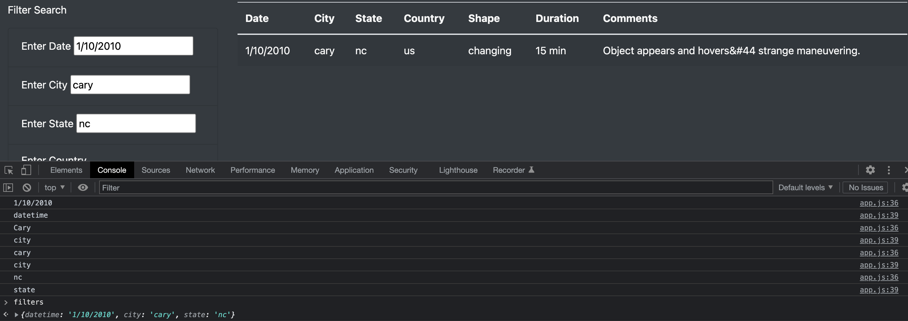
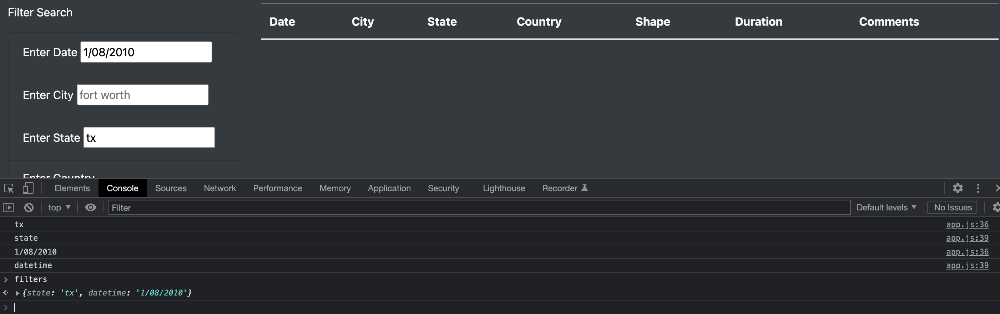

# UFOs

## Overview of Project

The purpose of this analysis is to display the UFO sightings data in a webpage using HTML, JavaScript ES6+, and CSS. We add filters to display any sightings a user would like to see.

## Results

For the webpage search criteria, instead of using a button, our `app.js` file uses the `d3.select(this)` when a filter is applied, and then stored in a JavaScript Object to then loop over the `data.js` and display the filtered data. In the console, every time the filters are applied, you can see the filters printed with their key and value. When you enter `filters` on the console, the console will display the `filters` object with the keys and values in the order the filter was applied.

## Summary

One of the drawbacks is how the filter is applied. The filters need to be searched in chronological order starting with date, and ending with shape. If the filters are applied in a different order, the webpage will not display the data, even if the data exists. Also, the search criteria is case sensitive. If the input does not equal the string in the data file, it will not display the filtered table.

My suggestion is using a function or module that makes the input not case sensitive. For instance, if the data is all lowercase, and the input is proper, use a function like Python's `lower()` function, which turns the string into all lowercase.

My second suggestion is using a more dynamic way of looping through the `filters` object so that the order doesn't need to be specific. It makes it more complicated when the `data.js` file is an array of objects, and the `filters` object is just an object.